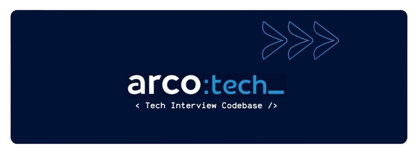

  

Bem-vindo ao repositório oficial de testes de codificação e desafios de design de sistemas da Arco Educação!

Este espaço foi criado para ajudar candidatos e desenvolvedores a se prepararem para entrevistas técnicas, oferecendo desafios práticos e realistas que abrangem desde problemas básicos até questões avançadas de design de sistemas.

## Descrição do Projeto
Este repositório centraliza uma variedade de testes de codificação e desafios de design de sistemas. Cada desafio foi cuidadosamente elaborado para refletir cenários reais, auxiliando na avaliação de habilidades técnicas e no desenvolvimento de soluções robustas e escaláveis.

## Estrutura do Repositório
O repositório está organizado em pastas de acordo com o nível de senioridade:

- **Software Engineer I:**
  - Focado em fundamentos de programação e problemas introdutórios, como componentes básicos em React (ex: Simple Counter, Todo List App, Simple Form Validation Component).
- **Software Engineer II:**
  - Testes que abordam desafios com complexidade intermediária, incluindo otimizações de desempenho e manipulação de estados em aplicações React mais elaboradas (ex: Dynamic Theme Switcher, Optimized List Filtering Component, Debounced Auto-Complete Search Input).
- **Software Engineer III:**
  - Desafios avançados que demandam alta performance, escalabilidade e conhecimento profundo de arquitetura de sistemas (ex: Advanced Component Performance Optimizer, Real-time Data Visualization Component, High Frequency Event Handler).

Cada nível contém testes organizados por tecnologia e área, permitindo que você navegue pelos desafios que estejam alinhados com seu perfil e objetivos profissionais.

## Conteúdo dos Desafios
Os desafios presentes neste repositório abrangem:

- **Desenvolvimento Front-end:** Criação e otimização de componentes React utilizando hooks, context API, e técnicas de lazy loading e virtualização.
- **Lógica e Algoritmos:** Problemas que testam sua capacidade de resolver desafios de programação com eficiência.
- **Design de Sistemas:** Cenários práticos para estruturar e projetar arquiteturas escaláveis, robustas e de fácil manutenção.
- **Boas Práticas:** Código limpo, organização modular e padrões de design que promovem a qualidade e a manutenibilidade do software.

## Informações Adicionais
- **Soluções:** As soluções para os desafios são mantidas em um repositório privado, acessível à equipe responsável pelo processo seletivo.
- **Licença:** Este projeto está licenciado sob a licença MIT. Consulte o arquivo [LICENSE](LICENSE) para mais detalhes.
- **Contato:** Em caso de dúvidas ou para mais informações, entre em contato com a equipe de Arco Educação.

---

Este repositório é uma iniciativa para elevar o nível de preparação dos candidatos e apoiar o desenvolvimento profissional no mercado de tecnologia.

Boa prática e sucesso em suas entrevistas!
